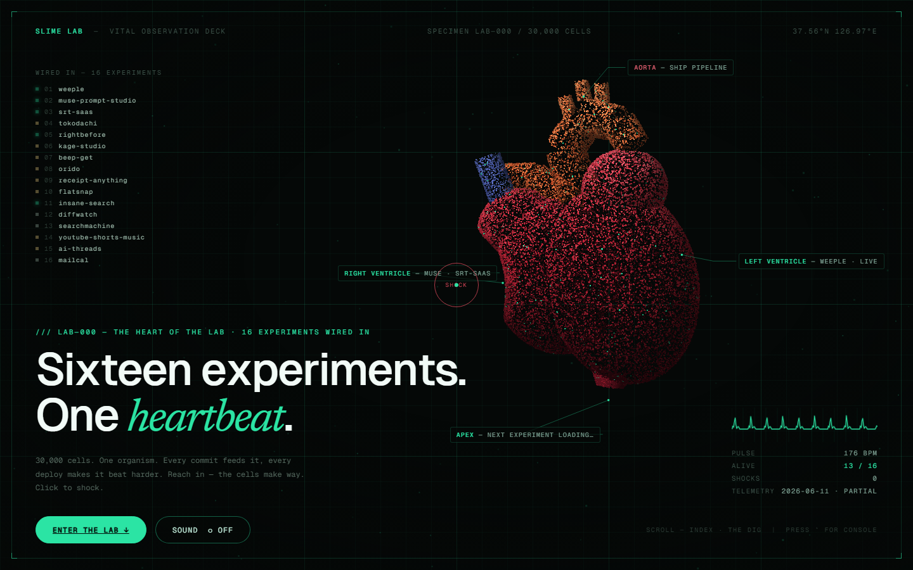
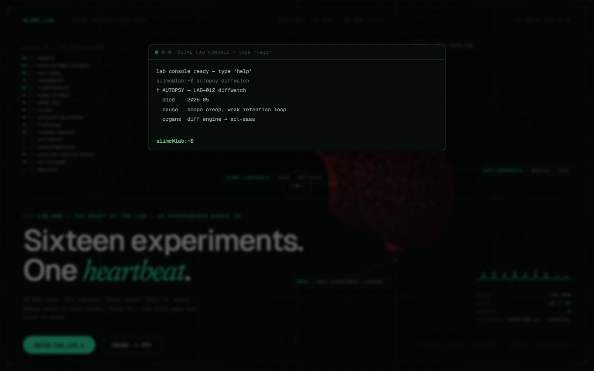
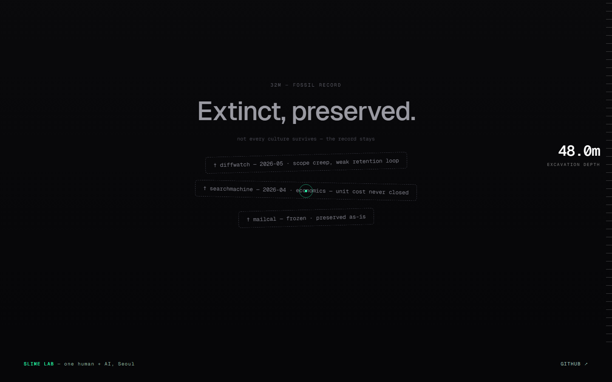

# SLIME LAB

> The lab has a heartbeat. — 1인 빌더의 실험실 포트폴리오. 모든 표본(프로젝트)이 하나의 심장에 배선되어 있고, 개발 활동이 심장을 뛰게 한다.

**Live (가칭 도메인):** https://slime-lab-bxb.pages.dev



| 터미널 이스터에그 (\` 키) | THE DIG — 화석층 부검 |
|---|---|
|  |  |

## 스택

Astro 5 (정적) + 순수 TS 엔진(`src/engine/` — WebGL POINTS 점묘 30k, 프레임워크 무관) + Cloudflare Pages.

## 명령

```bash
npm run dev        # 개발 서버
npm test           # vitest (엔진 순수 함수)
npm run build      # 정적 빌드 → dist/
npx wrangler pages deploy dist --project-name slime-lab   # 배포 (수동)
```

## 문서

- 설계 SoT: `docs/superpowers/specs/2026-06-11-slime-lab-design.md`
- M1 구현 계획(완료): `docs/superpowers/plans/2026-06-11-slime-lab-m1.md`
- 표본 콘텐츠: `src/content/specimens/*.md` / 바이탈(M1 정적): `src/data/vitals.json`

## 마일스톤 상태

- **M1 뼈대 출하 — 완료** (히어로 엔진, 표본 인덱스 16, 검사실, 배포)
- **M2 살아나기 — 완료** (vitals Worker cron 15분 + KV + 라이브 BPM/맥박/LAST SHIP, 케이스 스터디 16종 소스 팩트체크, View Transitions + 엔진 생명주기, prebuild 베이크)
- M3 — THE DIG 지층, 터미널 이스터에그, 사운드, OG 동적 이미지, 성능 폴리시(LCP 개선), Worker 핸들러 통합 테스트(miniflare)
- M4 — Awwwards SOTD 제출

## vitals Worker

- 엔드포인트: `https://slime-lab-vitals.slimex200.workers.dev` (CORS 공개, `?refresh`로 수동 갱신)
- 배포: `cd workers/vitals && npx wrangler deploy`
- **GITHUB_TOKEN secret 필수** (비인증은 공유 IP rate limit으로 사실상 불가): fine-grained PAT(Contents+Metadata read) 발급 후 `npx wrangler secret put GITHUB_TOKEN` — 값은 어디에도 기록하지 않는다
- 빈 결과는 KV 캐시를 덮어쓰지 않음(마지막 캐시 유지). archived/frozen은 flatline(맥박 0) 고정

## 알려진 항목 (M2 종료 시점)

- ~~미매핑 표본 4종~~ → 해소 (2026-06-12 기준 REPO_MAP 14종 전부 매핑, bake-vitals 14 live keys). insane-search/mailcal은 표본 목록에서 제외됨
- GITHUB_TOKEN 미설정 동안 private 레포는 `errors[]` + `auth:"degraded"` → UI "PARTIAL" 표기
- Lighthouse(모바일 스로틀): perf 90 — LCP는 히어로 SSR 고스트 리빌로 단축 (아래 M3 항목)
- 도메인 미정 (설계서 오픈 아이템 1)

## M3 완료 (2026-06-12)

- THE DIG 지층 시추(자연 스크롤, reduced-motion 폴백) + 화석 카드 → 부검 페이지 링크
- 터미널 이스터에그 (` 키): help/ls/status(라이브 vitals 연동)/autopsy/uptime — 데스크톱 전용
- 사운드 토글 (기본 OFF, 박동/쇼크 thump)
- OG: 빌드 시 히어로 캡처(배포 시점 BPM 반영) + 메타 태그. 라이브 동적 OG(Satori Worker)는 M4 전 검토로 이연
- Worker 핸들러 테스트 4종 (waitUntil 캡처) — 총 36 테스트
- Lighthouse: perf 89 / a11y·BP·SEO 100. LCP 3.5s는 엔트런스 reveal 연출 비용 — 추가 단축은 연출 트레이드오프 결정 필요
- LCP 개선 (2026-06-12): 헤드라인 char 스태거를 JS 빌드 → Astro 빌드 타임 SSR + CSS 애니메이션으로 이전, LCP 요소(히어로 문단)는 `.reveal-lcp` 고스트(opacity .12) 시작. 배포 후 실 Lighthouse(모바일): **perf 97 / a11y 100 / BP 100 / SEO 100, LCP 2.0s = FCP** (3회 중앙값, 이전 perf 89 · LCP 3.5s). robots.txt 추가로 SEO 91→100
